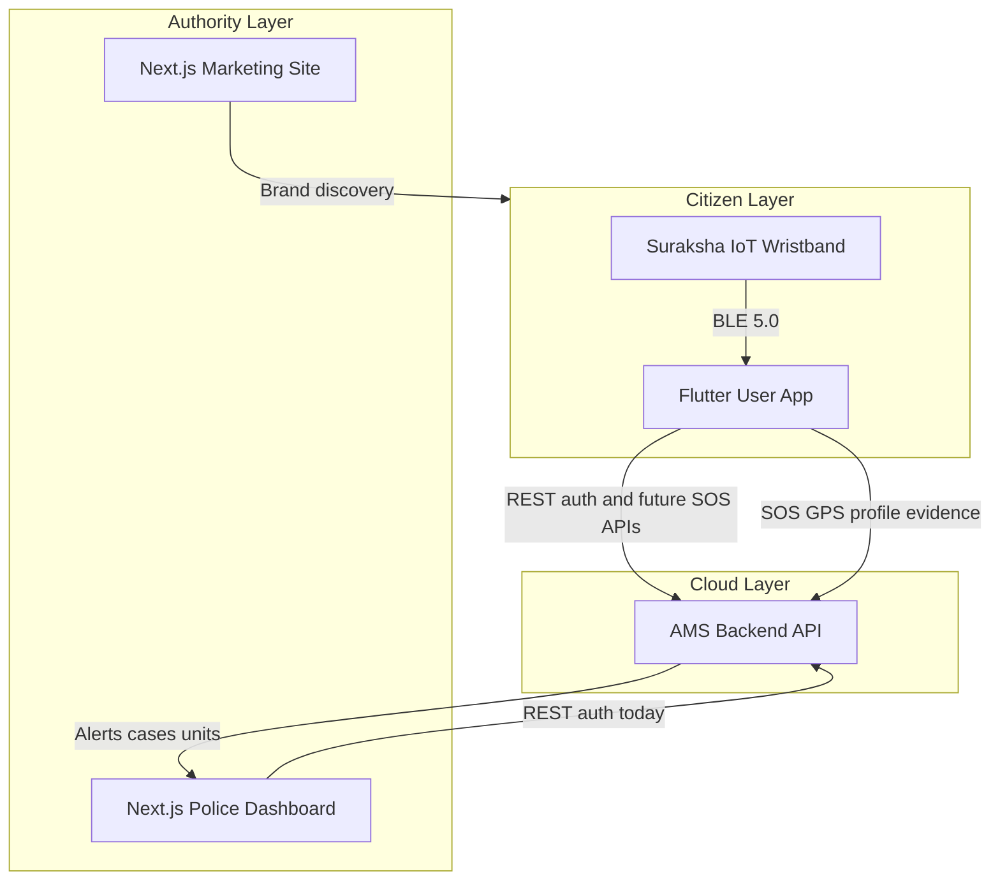
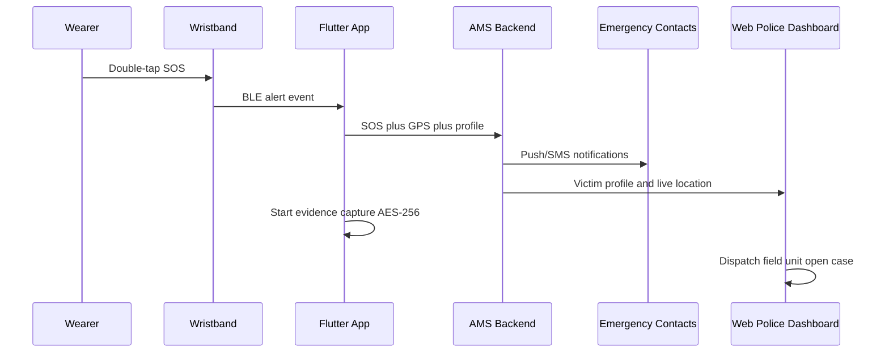

# Suraksha Project — Concept Paper Reference

**Product:** Suraksha (“The Guardian On Your Wrist”)  
**Organization:** Suraksha Safety Pvt. Ltd.  
**Geography:** Nepal (Nepal Police partnership, NPT timezone, provincial operations)  
**Engineering repo:** `surakshya-frontend` (Next.js web)  
**Companion:** Flutter mobile app (end user) — described below; source not in this repository  

This document is **not** an insurance or policy-management system. It is a **women’s safety IoT ecosystem**: wristband + mobile app + web (marketing + police command centre) + AMS cloud backend.

**Related docs:**

- [Hardware canonical spec](./HARDWARE_SPECIFICATION.md)
- [Diagram sources](./diagrams/README.md)

---

## 1. Executive Summary

**Suraksha** is a **women’s safety IoT ecosystem** for **Nepal**, combining:

| Layer | Role |
|-------|------|
| **IoT wristband** | Wearable SOS trigger, BLE link to phone, works without holding the phone |
| **Flutter mobile app** | **End-user** app: profile, family/emergency contacts, safety settings, band pairing, live GPS/SOS flows |
| **Next.js web app** | **Public marketing site** + **Nepal Police Command Centre** dashboard |
| **AMS backend** | Account Management System (`https://ams-omwj.onrender.com`) — auth today; future SOS/case APIs |

**Value proposition:** Double-tap SOS (see [hardware spec](./HARDWARE_SPECIFICATION.md)) sends **live GPS** to **family** and **authorities**; optional **evidence capture** (audio/location, AES-256); **Safe Walk** route monitoring; integration with **Nepal Police** for coordinated emergency response.

---

## 2. Problem Statement

- Women in Nepal face harassment, assault, and delayed emergency response when incidents occur without immediate, verifiable location and contact reachability.
- Phones may be inaccessible, dead, or taken during an incident; conventional “call 100” requires manual dialing and clear speech under stress.
- Families lack continuous visibility during commutes or night travel; police lack structured, real-time victim profiles and evidence chains at dispatch time.

**Suraksha addresses:** passive-wearable SOS, always-on location sharing with trusted contacts, automated evidence, and a **digital bridge to Nepal Police operations**.

---

## 3. Solution Overview — Three-Tier Ecosystem



*Exportable figure:* [`diagrams/01-ecosystem-architecture.mmd`](./diagrams/01-ecosystem-architecture.mmd)

---

## 4. Hardware — IoT Wristband

**Canonical specification:** See [HARDWARE_SPECIFICATION.md](./HARDWARE_SPECIFICATION.md).

| Spec / behavior | Detail |
|-----------------|--------|
| Form factor | Wrist-worn band; jewellery-like industrial design |
| Materials | Aerospace-grade materials (marketing) |
| Connectivity | **Bluetooth 5.0 BLE** to companion phone |
| Durability | **IP67** (canonical; IPX4 appears in one marketing section — pending hardware confirmation) |
| SOS trigger | **Double-tap** for emergency (police/ops); “one tap” in public marketing copy |
| Independence | SOS can fire **without phone in hand** once band is paired |
| 3D asset | `public/models/wristband.glb` — hero visualization via Three.js |

**Design narrative (5 hero chapters):** Welcome → Protection → Tracking → SOS → Evidence (`components/hero/TextPanels.tsx`).

---

## 5. Flutter Mobile App (End User)

> **Note:** The Flutter repository was not available in `surakshya-frontend`. This section combines **product owner description** (user dashboard for profile and family data) with **companion-app features** documented on the web marketing site.

### 5.1 Purpose and audience

- **Audience:** Citizen / wearer (women using Suraksha for personal safety).
- **Not for:** Nepal Police operators (they use the web command centre at `/dashboard`).
- **Role:** Operational hub — pair wristband, maintain identity and contacts, control safety modes, trigger or reflect SOS state from the band.

### 5.2 User dashboard (confirmed scope)

Per product design, the Flutter app provides a **user dashboard** where the wearer can manage:

| Area | Typical data |
|------|----------------|
| **Personal profile** | Name, age, phone, blood type, photo (mirrors police “victim profile” fields in mock data) |
| **Family / emergency contacts** | Multiple contacts with relationship (father, mother, brother, sister), name, Nepal-format phone |
| **Safety settings** | Alert preferences, geofencing, band pairing, notification toggles |
| **Incident history** | Past SOS events and resolutions (referenced in ecosystem; backend TBD) |

Registration and login align with **AMS** (`POST /auth/register`, `POST /auth/login`) — same backend as the web auth pages.

### 5.3 Five pillars of safety (marketing-aligned features)

From `components/AppFeaturesScroll.tsx` and `components/ProductShowcase.tsx`:

| Feature | Description | Claimed metric |
|---------|-------------|----------------|
| **One Tap SOS** | Live GPS to family + emergency contacts; band can trigger without phone in hand | < 2 s alert time |
| **Live GPS Tracking** | Real-time location to trusted contacts | 24/7 active |
| **Safe Walk Mode** | Route monitoring; stop or path deviation triggers alerts | ~10 m accuracy |
| **Evidence Capture** | Auto audio + location on SOS; encrypted storage | AES-256 |
| **Smart Alerts** | Geofencing, low battery, abnormal activity | 5+ alert types |

**SOS behaviour:** Marketing states SOS stays active until the **user** switches it off (`InnovationSection.tsx`).

### 5.4 Flutter ↔ band ↔ cloud flow

1. User pairs band over **BLE 5.0**.
2. User completes profile and emergency contacts in dashboard.
3. On **double-tap** (canonical hardware gesture), band notifies app → app sends GPS + profile to **AMS** → AMS notifies family and pushes victim profile to **police web dashboard**.
4. App may start **evidence capture** (audio/location) with AES-256 encryption.

### 5.5 Flutter vs web (concept paper table)

| Capability | Flutter (user) | Next.js web |
|------------|----------------|-------------|
| Profile & contacts | Primary | Signup: email/password only today |
| SOS trigger | Via band + app | N/A (receive only) |
| Police dispatch | N/A | `/dashboard` command centre |
| Marketing / brand | App store listing | `/` landing site |

### 5.6 Future documentation

When the Flutter repo path is added to the monorepo, extend this section with: screen map, state management, API client, and entity models.

---

## 6. Web Application (Next.js)

**Stack:** Next.js 16.2.4, React 19, TypeScript, Tailwind 4, shadcn/Radix, GSAP, Three.js, Recharts, Vercel Analytics. Dev: `pnpm dev` → port **3002**.

### 6a. Public marketing site (`/`)

**Sections** (`app/page.tsx`): Navbar, Hero (3D wristband), Philosophy, Craft, Innovation, Perspective marquee, App features scroll, Product showcase, Social wall, Brand statement, Newsletter, Footer.

**Routes:**

| Route | Purpose |
|-------|---------|
| `/` | Landing |
| `/login` | Sign-in → `/dashboard` |
| `/signup` | Register → `/login?registered=1` |

Google/Apple login buttons are **UI only**.

### 6b. Nepal Police Command Centre (`/dashboard`)

**Auth:** `AuthGuard` + `localStorage` tokens. No role-based access control yet.

| View | Function |
|------|----------|
| Command Overview | Stats, coverage panel, incoming SOS modal |
| SOS Alert Centre | Queue, victim profile, timeline |
| Case Management | Cases linked to `sosId`, status workflow |
| Field Units | Provincial units and dispatch status |
| Reports & Analytics | Metrics (mock) |
| Settings | Officer profile, notifications |

**Mock data:** `lib/dashboard/mock-data.ts`, `lib/dashboard/operations-data.ts` (Nepal districts, NPT, sample victim Priya Sharma, `SOS-2847`).

---

## 7. Backend — AMS

| Item | Detail |
|------|--------|
| Default URL | `https://ams-omwj.onrender.com` |
| Proxy | `/api/ams/*` → backend (`next.config.ts`) |
| Env | `API_URL` override |
| Live APIs | `POST /auth/register`, `POST /auth/login` |
| Tokens | `access_token`, `refresh_token` (refresh not wired in web UI) |

**Planned:** SOS ingest, victim profile push, cases, units, evidence vault, WebSockets for live map.

---

## 8. End-to-End Business Flows

### Flow A — Citizen SOS



*Exportable figure:* [`diagrams/02-sos-sequence.mmd`](./diagrams/02-sos-sequence.mmd)

**Mock timeline** (`SosAlertsView.tsx`): 07:38:12 double-tap → 07:38:14 GPS → 07:38:16 police dashboard → 07:38:18 family (3 numbers) → 07:38:22 audio evidence → 07:39:05 unit ack.

### Flow B — Safe Walk

User enables Safe Walk → route monitored → deviation/stop → automatic alerts (e.g. Pokhara case: deviation before SOS tap).

### Flow C — User onboarding

Register (Flutter or web) → AMS account → Flutter dashboard for profile + contacts (web signup currently sends email/password only).

### Flow D — Police operations (mock UI)

Incoming SOS modal → victim panel → unit dispatch → case `open` → `investigating` → `closed` / `escalated`.

---

## 9. Stakeholders and User Personas

| Persona | Primary tool | Goals |
|---------|--------------|-------|
| Woman / citizen | Flutter + band | Safety, SOS, contacts, location sharing |
| Family / emergency contact | SMS/push | Receive live GPS on SOS |
| Nepal Police operator | Web `/dashboard` | Monitor, dispatch, cases, analytics |
| Suraksha Safety Pvt. Ltd. | Web marketing | Brand, partnerships |
| Public visitor | Web `/` | Product education |

---

## 10. Security, Privacy, and Evidence

- **AES-256** for evidence (marketing + dashboard UI).
- **Chain of custody** — tamper-proof evidence toggle in settings mock.
- **Auth** — JWT-style tokens in `localStorage` (web).
- **Gaps** — No RBAC; refresh token unused; privacy policy links are placeholders.

**Concept paper angle:** Consent for location sharing; lawful evidence handoff to Nepal Police.

---

## 11. Technical Architecture Summary

```
┌─────────────────────────────────────────────────────────────┐
│                    SURAKSHA ECOSYSTEM                        │
├──────────────┬──────────────────────┬───────────────────────┤
│ IoT Band     │ Flutter (User)       │ Next.js Web           │
│ BLE SOS      │ Profile, contacts,   │ /  Marketing          │
│ IP67         │ GPS, Safe Walk, SOS  │ /dashboard Police     │
├──────────────┴──────────┬───────────┴───────────┬───────────┤
│                         │   AMS Backend (Render)  │           │
│                         │   Auth ✓  SOS ✗ (future)│           │
└─────────────────────────┴─────────────────────────┴───────────┘
```

| Area | Status |
|------|--------|
| Marketing UX | High |
| Police dashboard UI | High (mock data) |
| Auth integration | Partial |
| Live SOS / dispatch | Not connected |
| Consumer web dashboard | None (Flutter only) |

---

## 12. Suggested Concept Paper Outline

1. Title & Abstract  
2. Introduction — problem, objectives, Nepal Police scope  
3. Literature / related work — wearables, panic systems, regional safety apps  
4. System analysis — stakeholders, requirements (§5–6)  
5. Proposed system — architecture (§3, §11), hardware (§4, [HARDWARE_SPECIFICATION.md](./HARDWARE_SPECIFICATION.md))  
6. Mobile application (Flutter) — §5  
7. Web platform — §6  
8. Backend & data model — §7, §13  
9. Security & privacy — §10  
10. Implementation status — §11  
11. Testing & validation — KPIs (< 2 s alert; 4.2 min avg response in mock stats)  
12. Challenges — rural connectivity, false alarms, spec alignment  
13. Future work — real-time APIs, Nepali UI, RBAC, dealer network  
14. Conclusion  
15. References & appendices — diagrams in `docs/diagrams/`, screenshots  

---

## 13. Key Entities (data model appendix)

| Entity | Key fields |
|--------|------------|
| **User / Victim** | fullName, age, phone, bloodType, photo, emergencyContacts[] |
| **SosAlert** | id, citizen, district, ward, coordinates, triggeredAt, status, priority, triggerType, victim, liveLocation |
| **PoliceCase** | id, sosId, victimName, status, assignedUnit, officer, evidenceCount |
| **FieldUnit** | id, province, zone, status, vehicle, activeCase |
| **EmergencyContact** | relation, name, phone |

Source types: `lib/dashboard/mock-data.ts`, `lib/dashboard/operations-data.ts`.

---

## 14. Gaps and Limitations

- Flutter codebase not in repo — §5 based on product description + web marketing.  
- Police dashboard uses **static mock** Nepal-themed data.  
- Web signup UI collects `firstName` but API sends `{ email, password }` only.  
- No WebSocket/real-time layer in frontend.  
- Hardware: confirm IP67 and double-tap with hardware team ([HARDWARE_SPECIFICATION.md](./HARDWARE_SPECIFICATION.md)).  
- Not insurance, booking, or claims.

---

## 15. Elevator Pitch (copy-ready)

*Suraksha is a Nepal-focused women’s safety platform combining an IoT wristband, a Flutter companion app for users to manage their profile and family emergency contacts, and a Next.js web presence that markets the product and provides Nepal Police with a command-centre dashboard for SOS monitoring, case management, and field-unit coordination. A double-tap on the band transmits live GPS to trusted contacts and authorities, while Safe Walk monitoring and AES-256 encrypted evidence capture strengthen prevention and prosecution. The AMS cloud backend authenticates users today and is designed to anchor future real-time alert and case-management services.*

---

*Document generated for concept paper writing — Suraksha Safety Pvt. Ltd., May 2026.*
